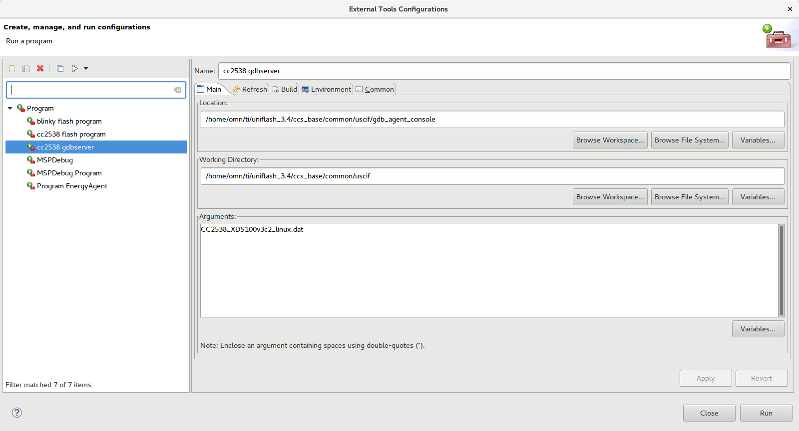
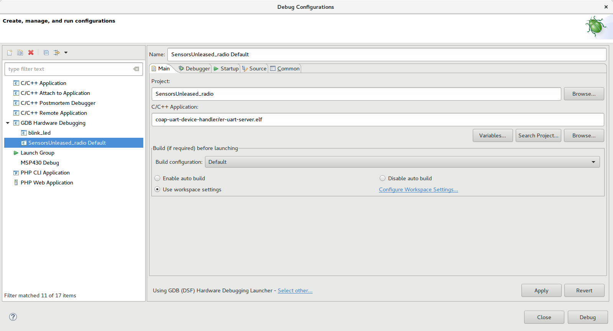
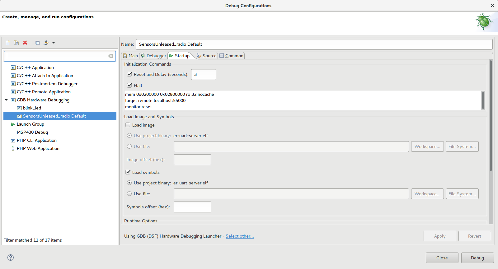
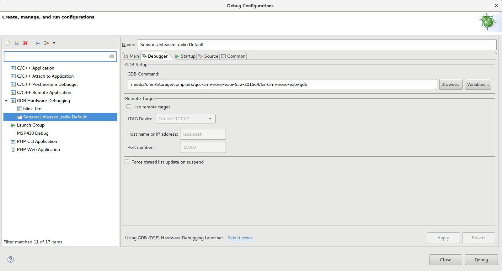

# Howto: Start cooperating with the "Sensors Unleashed project"

This howto is under development., but perhaps it can help you getting startet using: eclipse + xds100v3 + cc2538 + contiki, and hopefully help develop the best personal sensornetwork there is. Period.

## Flash Programming

## Debugging

### Prerequist

* Uniflash installed and working (I used version 3.4)

### GDB server

### Eclipse Debug
Enter the Eclipse "Debug Configurations" screen and create a new launch configuration.
Make your debugging configuration reflect the nest 3 screenshots.

When done - hit close.
